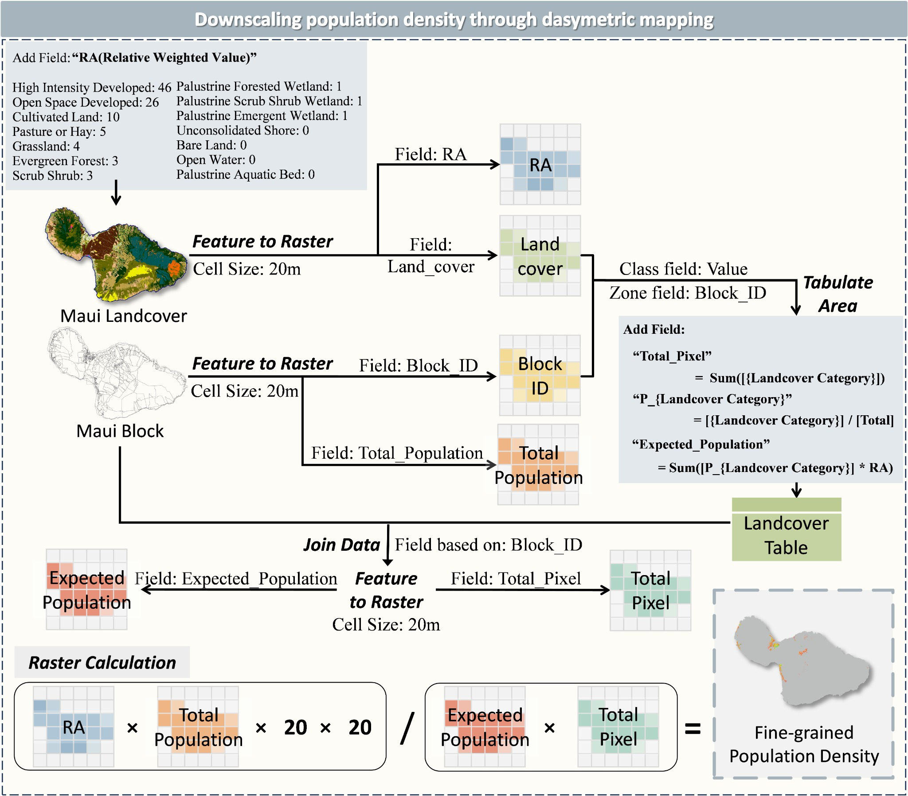

# Dasymetric Mapper: High-Resolution Population Density Layer Generation

## Overview
This repository contains the computer code that supported the publication of our research: "Multi-source Tri-environmental Conceptual Framework for Fire Impact Analysis" (under review in Urban Informatics). This package helps researchers quickly generate high-resolution population density layers using dasymetric mapping, a sophisticated geospatial technique that leverages detailed land cover data to distribute demographic data across predefined spatial units, such as census blocks.The main contribution of this package is in Haiyan Li [lihaiyan@usc.edu]
## Background
Dasymetric mapping is a geospatial technique that uses detailed land cover data to distribute demographic data across predefined spatial units such as census blocks. Despite its relatively simple input requirements, the process can be complex and cumbersome in ArcGIS. This package streamlines the process, making it more accessible for future researchers.

## Population Density Data
Commonly used population density datasets include:
- LandScan (2022) provided by Oak Ridge National Laboratory (ORNL) with a resolution of 1 km.
- WorldPop (2021) which offers data at grid levels of 100m x 100m in urban areas and 1km x 1km in less densely populated regions.

However, both layers have resolutions that are too low for detailed fire impact analysis. Therefore, we employ dasymetric mapping to refine a high-resolution population density layer (20m x 20m) for fire analysis, balancing high resolution and computational difficulty.

## Files
- `src/Main.py`: Main script for the mapping process.
- `src/Dmapping.ipynb`: Jupyter notebook with detailed implementation.

For more details, please see the individual files.

## Contact
For any questions or issues, please contact Zongrong Li at zongrong@usc.edu.

## License
This project is licensed under the MIT License. See the LICENSE file for more details.

